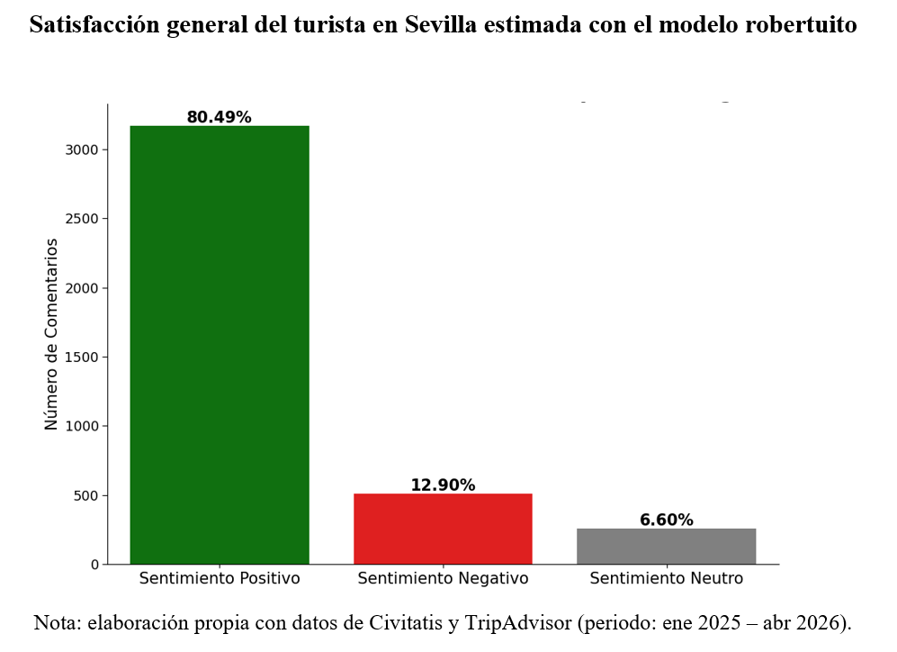
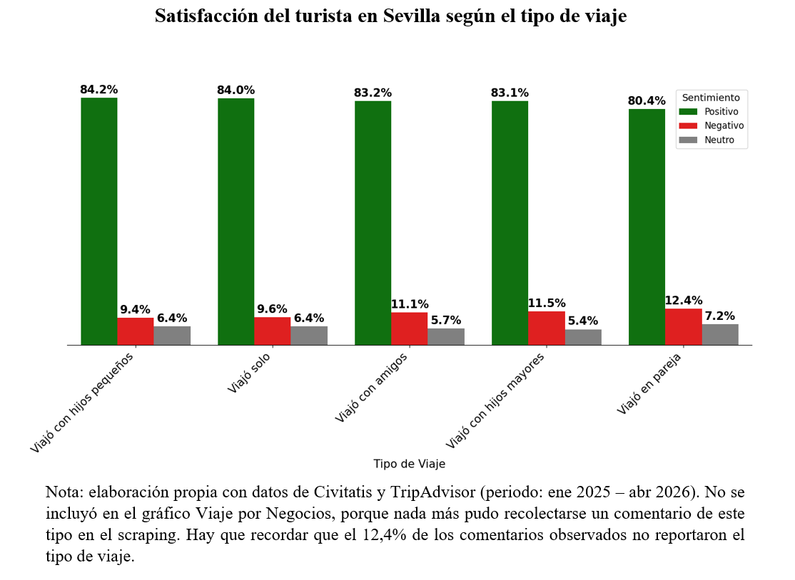
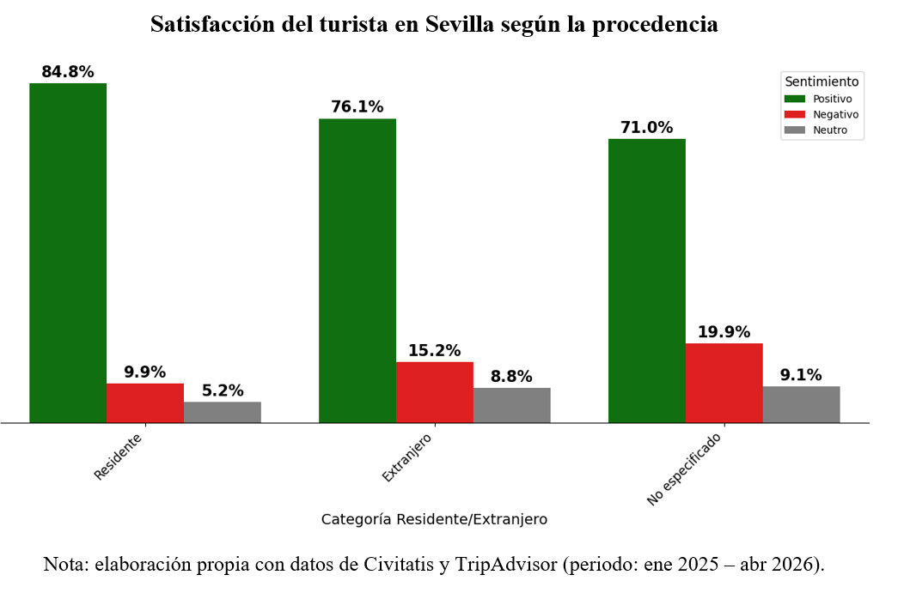
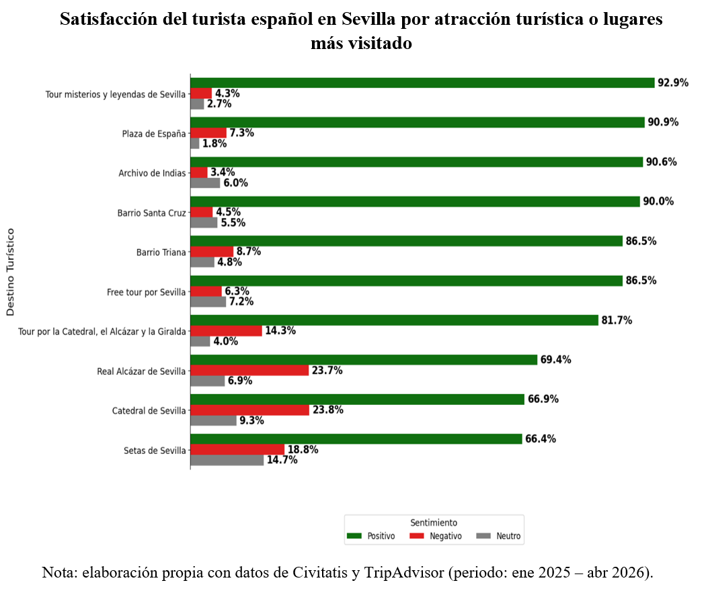
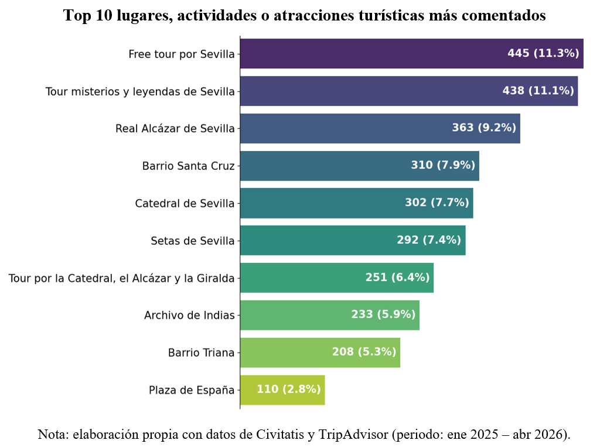
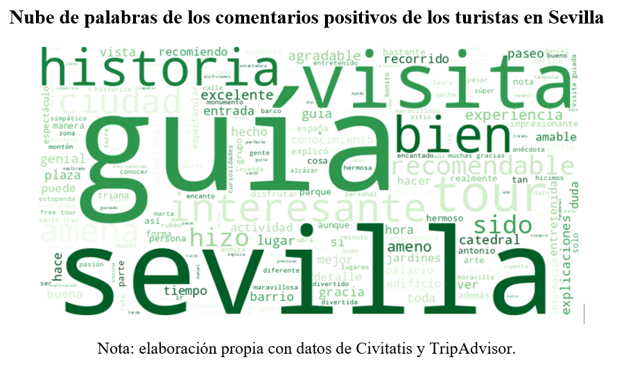
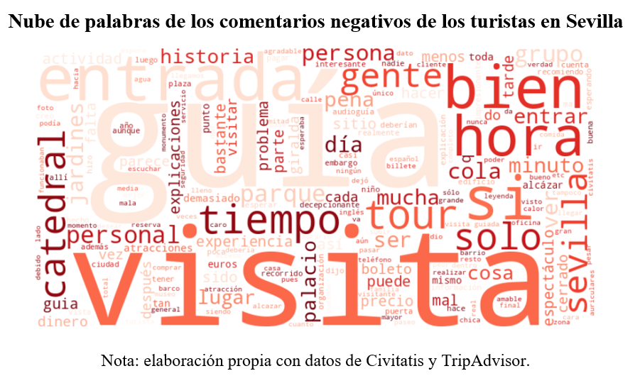

# Tourist Satisfaction Analysis in Seville Using NLP

## Project Overview

This project analyzes tourist satisfaction in Seville through the study of online reviews collected from TripAdvisor and Civitatis.

Using Natural Language Processing (NLP) techniques and transformer-based language models, the project evaluates visitor sentiment, identifies common themes in tourist experiences, and explores the main drivers of satisfaction and dissatisfaction.

The analysis was conducted as part of a collaboration with the Institute of Statistics and Cartography of Andalusia (IECA), with the objective of assessing the potential of user-generated content as a complementary source for tourism intelligence.

---

## Project Highlights

- Analysed 3,937 tourist reviews from TripAdvisor and Civitatis.
- Estimated overall tourist satisfaction in Seville using NLP techniques.
- Applied the Spanish transformer model roBERTuito for sentiment classification.
- Compared satisfaction by travel type, visitor origin, and tourist attraction.
- Identified key drivers of satisfaction and dissatisfaction through thematic analysis.
- Developed evidence-based recommendations for tourism management.
- Conducted during an internship at the Institute of Statistics and Cartography of Andalusia (IECA).

---

## Research Questions

- What is the overall level of tourist satisfaction in Seville?
- Can online reviews be used as a reliable source for measuring tourist satisfaction?
- What aspects of the tourist experience generate positive or negative sentiment?
- Are there differences in satisfaction across attractions and tourism services?
- How can NLP support tourism policy and destination management?

---

## Data Collection

The dataset was obtained through web scraping of online reviews published on:

- TripAdvisor
- Civitatis

The collected reviews correspond to major tourist attractions and tourism services located in Seville.

An anonymized version of the dataset is included in this repository.

---

## Methodology

The analysis followed four main stages.

### 1. Data Collection

- Web scraping of tourist reviews
- Metadata extraction
- Data cleaning and preprocessing

### 2. Sentiment Analysis

Sentiment classification was performed using the Spanish transformer-based model **roBERTuito**.

Reviews were classified into:

- Positive
- Neutral
- Negative

### 3. Thematic Analysis

Reviews were analyzed to identify recurring topics associated with:

- Tourist attractions
- Visitor experiences
- Service quality
- Urban environment
- Cultural heritage

### 4. Statistical Analysis and Visualization

- Descriptive statistics
- Sentiment distributions
- Comparative analysis
- Data visualization

---

## Main Results

- Analysis of 3,937 tourist reviews from TripAdvisor and Civitatis.
- More than 80% of reviews expressed positive sentiment.
- Positive reviews largely focused on cultural heritage, architecture, guided tours, and visitor experiences.
- Negative reviews were mainly associated with service quality, waiting times, ticket access, and organizational issues.
- NLP techniques proved effective for extracting actionable insights from unstructured tourism data.

---

## Key Visual Results

### Overall Tourist Satisfaction



### Tourist Satisfaction by Type of Trip



### Tourist Satisfaction by Visitor Origin



### Tourist Satisfaction by Attraction



### Most Commented Attractions



### Positive Reviews Word Cloud



### Negative Reviews Word Cloud



---

## Repository Structure

```text
tourist-satisfaction-seville-nlp/
│
├── data/
│   ├── tourist_reviews_anonymized.csv
│   └── README.md
│
├── results/
│   ├── overall-tourist-satisfaction.png
│   ├── tourist-satisfaction-by-type-of-trip.png
│   ├── residents-and-foreigners-tourist-satisfaction.png
│   ├── tourist-satisfaction-of-most-commented-attractions.png
│   ├── most-commented-attractions.png
│   ├── positive-comments-word-cloud.png
│   ├── negative-comments-word-cloud.png
│   └── README.md
│
├── Seville_Tourist_Satisfaction_Analysis.ipynb
├── requirements.txt
└── README.md
```

---

## Technologies Used

- Python
- Pandas
- Matplotlib
- Seaborn
- PySentimiento
- roBERTuito
- WordCloud
- NLP
- Google Colab

---

## Skills Demonstrated

- Natural Language Processing (NLP)
- Sentiment Analysis
- Transformer-Based Language Models
- Web Scraping
- Text Mining
- Data Cleaning and Preprocessing
- Exploratory Data Analysis (EDA)
- Data Visualization
- Tourism Analytics
- Statistical Analysis
- Computational Social Science
- Applied Artificial Intelligence
- Research Communication

---

## Author

**Carlos F. Carreras De León**

MSc in Social Data Science

University of Granada
